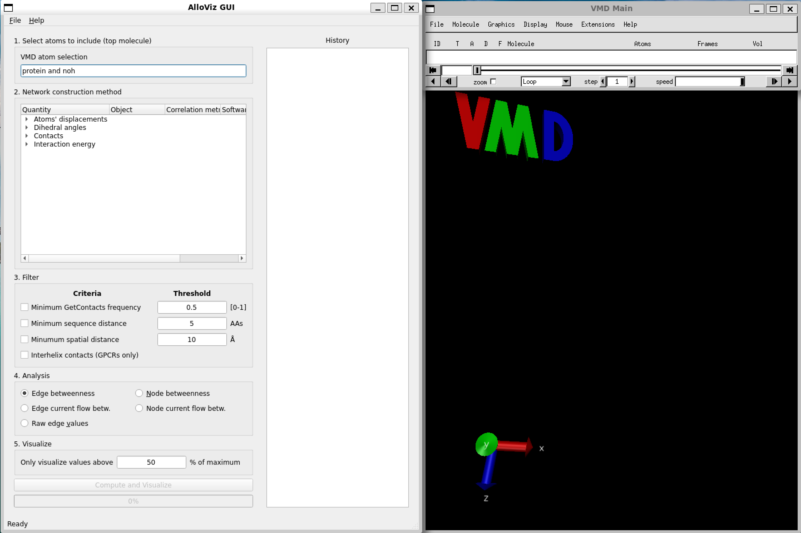
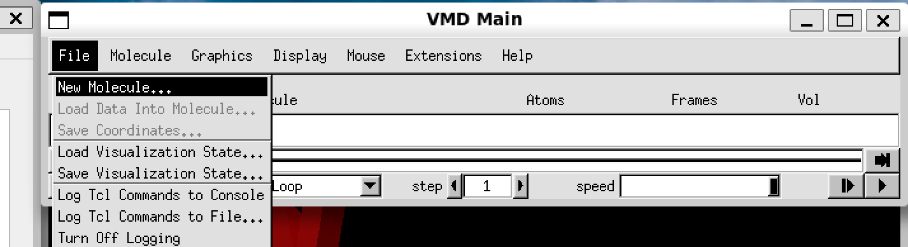
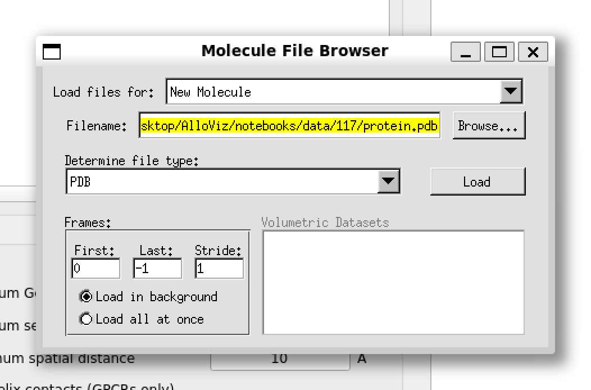
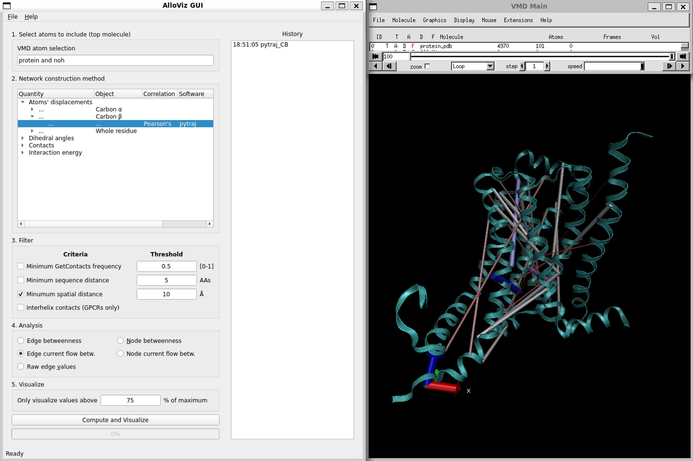
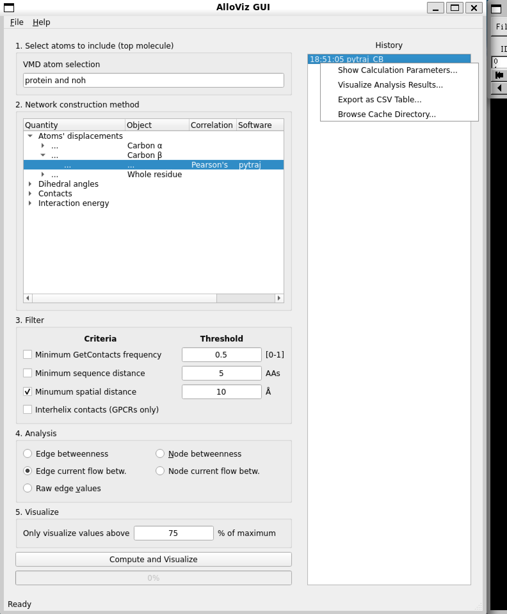

GUI
===

AlloViz can be run with a Graphical User Interface (GUI) that uses `VMD <https://www.ks.uiuc.edu/Research/vmd/>`__ (Visual Molecular Dynamics)
for the visualization of the networks and analyses on the protein structure. VMD must be installed.

.. note::
    The ``json`` library for VMD must be installed as well. It is already included in the alpha version of VMD 1.9.4.

    Alternatively, both stable VMD 1.9.3 and the ``json`` library can be installed in a conda environment: ``conda install -c conda-forge --solver libmamba vmd tcllib``

    ``sqlite`` 3.41 or higher might need to be installed in case of an ``sqlite3``-related error when trying to launch the GUI.
..

To launch the GUI, run the following command on an environment with AlloViz and VMD installed:

.. code:: bash

   vmd -e gui/run_vmd.tcl

This is how the GUI looks like:

|

We can load one of the structures and trajectories that come with AlloViz's tutorial notebooks into VMD as usual.
They are located in `AlloViz/tutorials/data/117` and they correspond to the GPCR Beta-2 adrenergic receptor in complex with agonist epinephrine (GPCRmd ID `117 <https://submission.gpcrmd.org/view/117/>`__).
We can use a stride of 25 frames for the trajectory to speed up the loading process.

.. image:: gui_pics/loadtraj.png
    :width: 49 %
    :alt: VMD Molecule file browser window showing the trajectory file to be loaded into the previously loaded molecule entity.

|

In the AlloViz GUI window we can choose the specific options we want to build, analyze and represent our network of choice:

#. The first step is to specify the atom selection to be taken into account for analysis. The trajectory provided with the notebooks is already processed and doesn't contain waters, ions or a ligand so we simply use the default selection of the whole protein.
#. Then, we choose the type of network to compute out of all the :ref:`options <table:Network construction methods>` AlloViz offers. In this case, we choose to measure the Pearson's correlation of the residues' beta-carbons using the package `pytraj`.
#. We choose to filter the computed network by only keeping residue pairs that are further apart than 10 Ångstroms in the structure.
#. Finally, we pick to analyze the networks' edges using the current-flow betweenness centrality metric.
#. And choose to represent on the structure in the VMD visualizer the top edges with a value above 75% of the maximum value.

.. image:: gui_pics/allovizgui.png
    :width: 100 %
    :alt: AlloViz GUI window with the used options selected

|

After clicking "Compute and Visualize", the selected options are represented on the protein structure on the VMD visualization window (we have changed the representation from the default to Cartoon):

|

Moreover, the calculated network and all the following analyses we might perform are logged in the right panel of the AlloViz VMD window, 
and we can get back to a previous analysis or even save the data in `.csv` format by right-clicking on the analysis and selecting the desired option:

